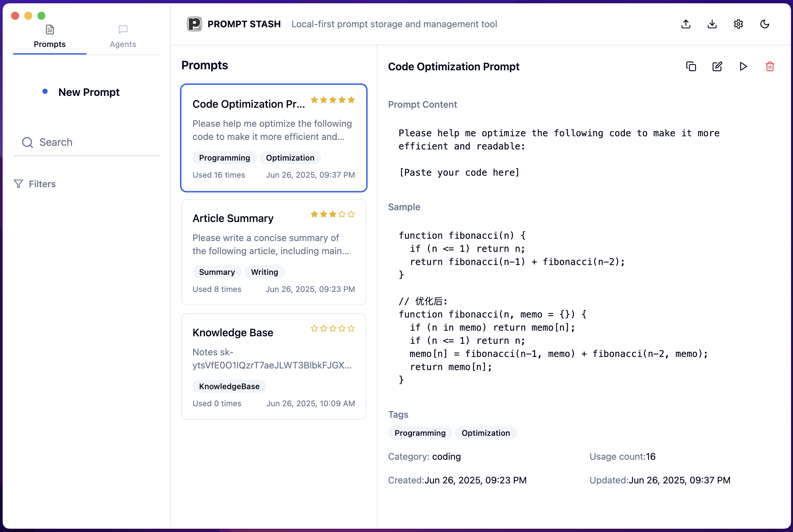
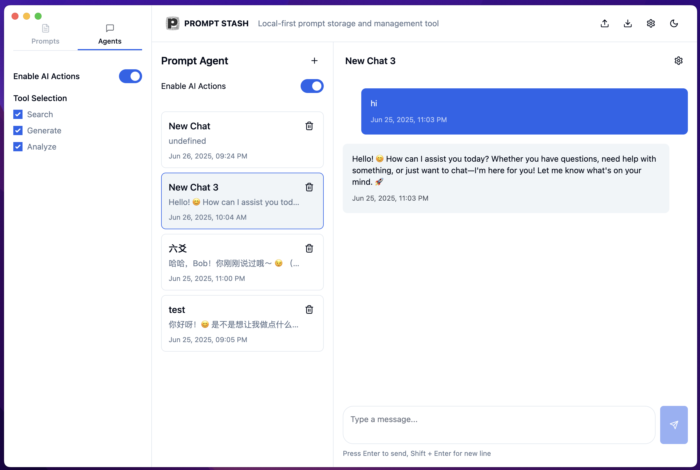
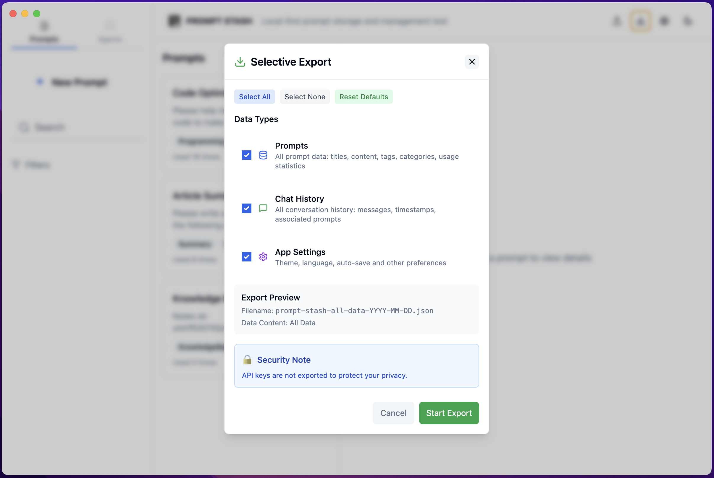
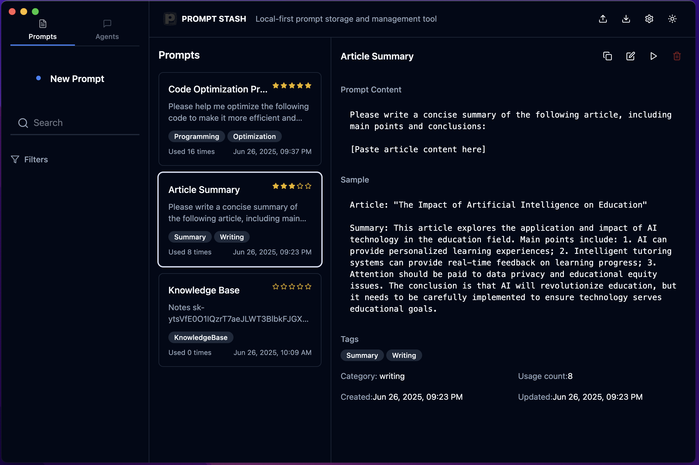

# Prompt Stash

A professional prompt storage and management application designed for AI workflow optimization. Built with modern web technologies and focused on local-first data privacy.

## Overview

Prompt Stash is a comprehensive solution for managing, organizing, and deploying AI prompts with integrated chat functionality. The application prioritizes user privacy through local storage while providing enterprise-grade features for prompt management and AI interaction.


## Installation
Download Mac/win version in the release.


## Screenshots

### Prompt Management Interface

*Main prompt management interface showcasing prompt library, tagging system, and detailed content preview*

### AI Chat Interface

*Selective export functionality supporting prompts, chat history, and application settings export*

### download and upload data

*Code optimization prompt example with complete prompt content and sample code*

### dark mode

*AI chat interface with multi-session management and real-time conversation capabilities*

## Core Features

**Data Management**
- Local-first architecture ensuring complete data privacy
- Comprehensive prompt creation, editing, and organization capabilities
- Advanced tagging and categorization system
- Intelligent search and filtering mechanisms

**User Experience**
- Responsive design optimized for all device types
- Light and dark theme support with system preference detection
- Intuitive user interface with modern design principles
- Real-time streaming chat responses with typing indicators

**AI Integration**
- Built-in AI agent with DeepSeek API integration
- Multiple chat session management
- Message history and conversation persistence
- Advanced streaming output with visual feedback

**Organizational Tools**
- Category-based prompt organization
- Favorites system for frequently used prompts
- Usage statistics and analytics
- Bulk operations and management tools

## Technical Architecture

**Frontend Stack**
- Next.js 14.2.30 with App Router architecture
- TypeScript for type-safe development
- Tailwind CSS for utility-first styling
- Lucide React for consistent iconography

**Development Tools**
- ESLint for code quality assurance
- PostCSS for advanced CSS processing
- Apple system fonts for native appearance
- Local storage for client-side data persistence

**Key Dependencies**
- React 18 with latest features
- Next.js optimized for production
- Tailwind CSS for responsive design
- Modern browser APIs for enhanced functionality

## Installation Guide

**Prerequisites**
- Node.js 18.0 or higher
- npm 8.0 or higher
- Modern web browser with ES6+ support

**Setup Process**

1. Clone the repository
   ```bash
   git clone <repository-url>
   cd prompt-lab
   ```

2. Install dependencies
   ```bash
   npm install
   ```

3. Configure environment (optional)
   ```bash
   cp .env.example .env.local
   # Configure API keys if needed
   ```

4. Start development server
   ```bash
   npm run dev
   ```

5. Access application
   ```
   http://localhost:3000
   ```

## Project Structure

```
public/
└── favicon.png            # Application favicon (from electron/assets/icon.png)

src/
├── app/                    # Next.js App Router configuration
│   ├── globals.css        # Global styling and CSS variables
│   ├── layout.tsx         # Root layout component
│   └── page.tsx           # Main application entry point
├── components/            # Reusable React components
│   ├── AgentChat.tsx      # AI chat interface component
│   ├── Header.tsx         # Application header navigation
│   ├── NewPromptDialog.tsx # Prompt creation modal
│   ├── PromptManager.tsx  # Prompt management interface
│   ├── SettingsDialog.tsx # Application settings modal
│   ├── Sidebar.tsx        # Navigation sidebar component
│   ├── ThemeProvider.tsx  # Theme management provider
│   ├── Toast.tsx          # Notification system
│   └── ui/                # UI component library
├── constants/             # Application configuration
│   └── index.ts          # Centralized constants and text
├── hooks/                 # Custom React hooks
│   ├── useLocalStorage.ts # Local storage management
│   └── useToast.ts       # Toast notification system
├── lib/                   # Utility functions and helpers
│   └── utils.ts          # Common utility functions
└── types/                 # TypeScript type definitions
    └── index.ts          # Application type definitions
```

## Feature Documentation

**Prompt Management System**
- Create, edit, and delete prompts with rich text support
- Organize prompts using categories and tags
- Advanced search functionality with multiple filters
- Batch operations for efficient management
- Export and import capabilities for data portability

**AI Chat Interface**
- Real-time streaming responses with visual indicators
- Multiple conversation management
- Message history preservation
- Copy functionality for easy prompt testing
- Integration with prompt library for quick access

**Theme and Customization**
- Automatic system theme detection and synchronization
- Manual theme toggle with instant feedback
- Persistent theme preferences across sessions
- Optimized color schemes for accessibility

**Data Privacy and Security**
- Complete local data storage with no external dependencies
- No telemetry or analytics collection
- Secure API key management for AI services
- Data export for backup and migration purposes

## API Integration

**DeepSeek API Configuration**
1. Obtain API key from DeepSeek platform
2. Configure API key in application settings
3. Test connection through chat interface
4. Monitor usage and rate limits

**Supported AI Models**
- DeepSeek Chat model for conversational AI
- Streaming response support for real-time interaction
- Configurable model parameters for customization

## Development Commands

**Standard Operations**
```bash
# Start development server with hot reload
npm run dev

# Build production-optimized version
npm run build

# Start production server
npm start

# Run code quality checks
npm run lint

# Type checking
npm run type-check
```

**Advanced Development**
```bash
# Clean build artifacts
rm -rf .next && npm run build

# Analyze bundle size
npm run build && npm run analyze

# Run in different environments
NODE_ENV=production npm run dev
```

## Configuration Management

**Application Constants**
All user-facing text, configuration options, and default values are centralized in `src/constants/index.ts` to facilitate maintenance and potential internationalization.

**Environment Variables**
- `NEXT_PUBLIC_API_URL`: API endpoint configuration
- `NEXT_PUBLIC_APP_NAME`: Application name override
- `NODE_ENV`: Environment detection for optimization

## Browser Compatibility

**Supported Browsers**
- Chrome 90+
- Firefox 88+
- Safari 14+
- Edge 90+

**Required Features**
- ES6+ JavaScript support
- CSS Grid and Flexbox
- Local Storage API
- Fetch API with streaming support

## Performance Optimization

**Built-in Optimizations**
- Next.js automatic code splitting
- Image optimization and lazy loading
- CSS optimization and minification
- Tree shaking for reduced bundle size

**Recommended Practices**
- Regular cleanup of local storage data
- Browser cache management for optimal performance
- Network optimization for API calls

## Contributing Guidelines

**Development Workflow**
1. Fork the repository and create a feature branch
2. Implement changes following established coding standards
3. Add comprehensive tests for new functionality
4. Update documentation as needed
5. Submit pull request with detailed description

**Code Standards**
- TypeScript strict mode compliance
- ESLint configuration adherence
- Consistent formatting with Prettier
- Comprehensive error handling

**Commit Message Format**
```
type(scope): description

- Use present tense and imperative mood
- Include detailed description for complex changes
- Reference issues and pull requests when applicable
```

## Support and Documentation

**Getting Help**
- Review existing documentation and examples
- Check issue tracker for common problems
- Submit detailed bug reports with reproduction steps

**Feature Requests**
- Discuss proposed features through issue tracker
- Provide use cases and implementation suggestions
- Consider contribution opportunities for feature development

## License Information

This project is licensed under the MIT License. See the LICENSE file for complete terms and conditions.

**Third-Party Licenses**
- All dependencies maintain their respective licenses
- Attribution provided in package.json and documentation
- Regular dependency auditing for security compliance

---

**Version**: 1.0.1 
**Last Updated**: 2025
**Maintainers**: Development Team 